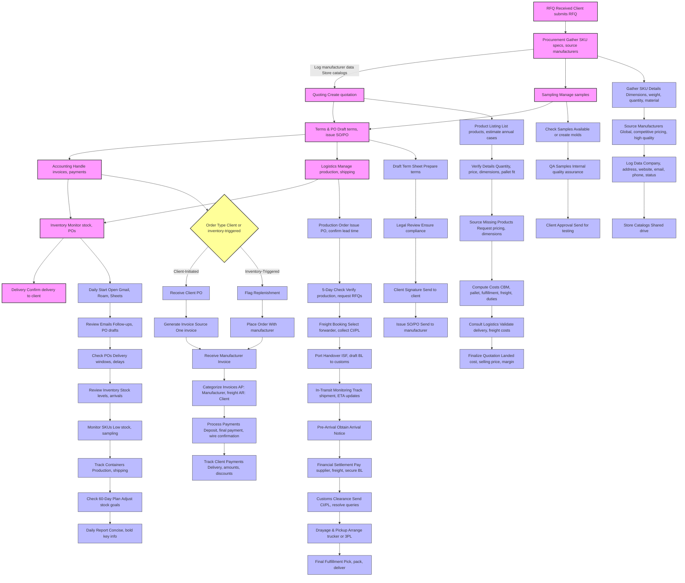
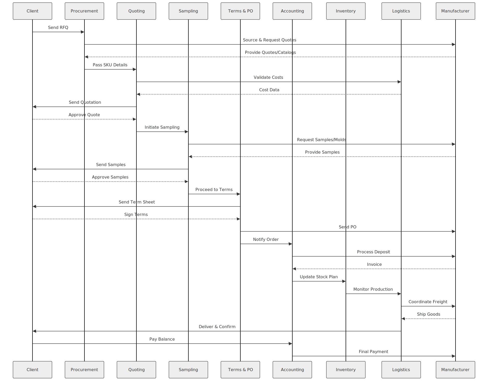

# Software Architecture
This page includes a short description of the overall architecture style of the system, its high-level system components, and their logical (what data they exchange) and control (how they invoke each other) dependencies. Mostly described using diagrams.

## Architecture Diagram

A NextJS-Django stack built on Docker and hosted on AWS. The frontend will be statically built, the django server will be running on a separate container. The server will be running the business and persistence layers. The DB is postgres and will be a docker volume attached to the Django container. In addition emails will be sent through [Sendgrid](https://sendgrid.com/). The frontend will communicate with the backend using REST in JSON (header + body) format. 

## System Workflow

## Sequence Diagram
> - 

## MindMap
> - 
